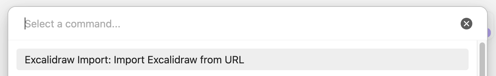
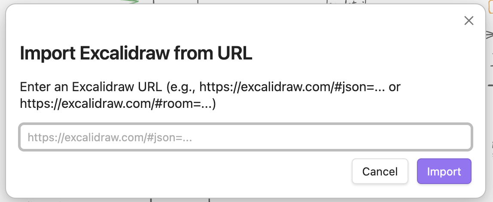
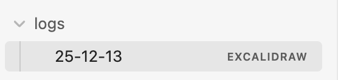

# Excalidraw Import Plugin for Obsidian

Import Excalidraw scenes from public URLs directly into Obsidian.

## Features

- Import Excalidraw scenes by URL from `excalidraw.com`
- Support for `#json=ID,KEY` format
- Support for `#room=ROOM_ID,KEY` format (if the room is saved on the server)
- Automatic saving to the `logs` folder
- Automatic file naming: `DD-MM-YY.excalidraw`

## Installation

1. Copy the `main.js` and `manifest.json` files to the `.obsidian/plugins/excalidraw-import/` folder of your vault
2. Restart Obsidian
3. Enable the plugin in settings: Settings → Community plugins → Excalidraw Import

## Usage

1. Open the command palette (`Cmd+P` on Mac, `Ctrl+P` on Windows/Linux)
2. Type "EXCALIDRAW Import"
   <details>
   <summary>Show image</summary>
   
   </details>
3. Paste the URL of the Excalidraw scene, for example:
   - `https://excalidraw.com/#json=iZjneM_FyVAopRFr6j0HR,oUua4UgiBHpuehmPsp3MCg`
   - `https://excalidraw.com/#room=f15d632f15a515ddfcfd,Uak2P-GzHSXNH39tBSBfuQ`
   <details>
   <summary>Show image</summary>
   
   </details>
4. Press OK
5. The file will be saved in the `logs` folder with a name like `YY-MM-DD.excalidraw`
   <details>
   <summary>Show image</summary>
   
   </details>

## Development

```bash
# Install dependencies
npm install

# Build the plugin
npm run build

# Run tests
npm test
```

## License

MIT
